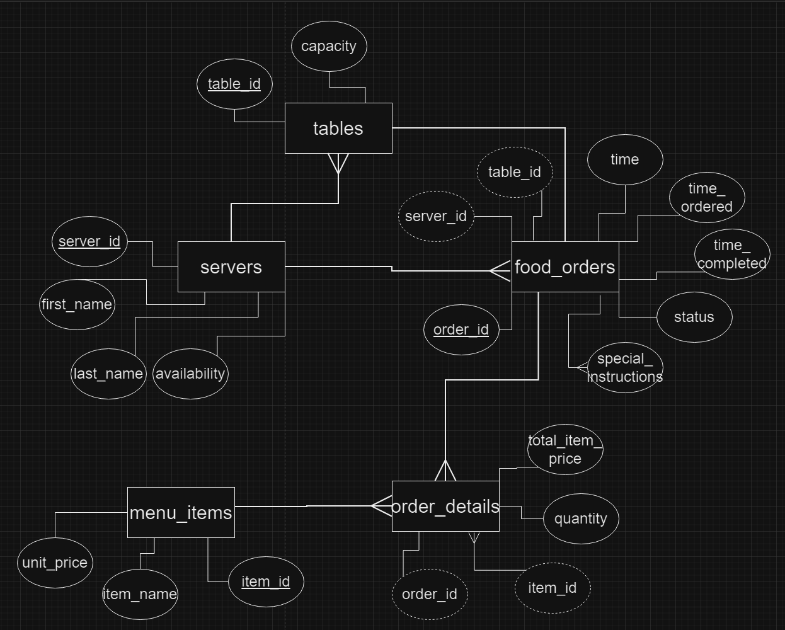
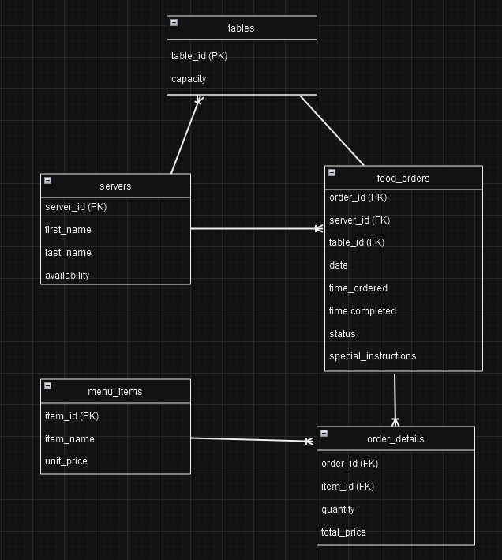
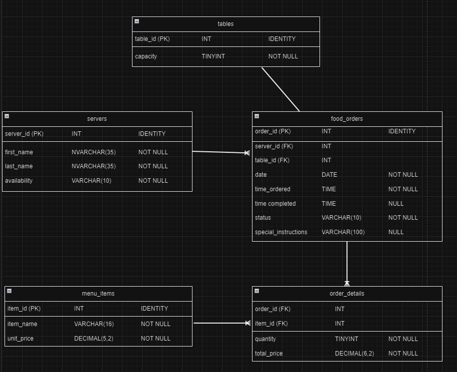

# OrderMaster Model Descriptions

## Conceptual Model

The conceptual model for the OrderMaster database lays out a simple, easy-to-understand diagram of the database's entities, their relationships among themselves, and their attributes. This allows any individual to follow the database's flow, regardless of their experience level.

### Entities Overview
---

#### **servers**
The Servers entity represents the workers in the restaurant who are in charge of delivering orders to customers.

| Attribute    | Description                                                                                       |
|--------------|---------------------------------------------------------------------------------------------------|
| **server_id** | Unique identifier for each server. Primary key.                                                   |
| **first_name** | First name of the server.                                                                         |
| **last_name** | Last name of the server.                                                                          |
| **availability** | Status indicating whether a server is available for new orders (e.g., off-shift, on-shift).     |

**Relationships:**  
- 1:M relationship with `food_orders`: A server may be assigned to many orders.

---

#### **tables**
The Tables entity represents the individual tables that are available at the restaurant.

| Attribute     | Description                              |
|---------------|------------------------------------------|
| **table_id**  | Unique identifier for each table. Primary key. |
| **capacity**  | Number of seats available at the table. |
  
**Relationships:**  
- 1:1 relationship with `food_orders`: A table is assigned one order at a time.

---

#### **food_orders**
The food_orders entities represent an entire order that was taken from a customer.

| Attribute             | Description                                                   |
|-----------------------|---------------------------------------------------------------|
| **order_id**          | Unique identifier for each order. Primary key.                |
| **server_id**         | ID of the server assigned to this order. Foreign key to `servers`. |
| **table_id**          | ID of the table for the order. Foreign key to `tables`.       |
| **date**              | Date when the order was placed.                               |
| **time_ordered**      | Time when the order was entered.                              |
| **time_completed**    | Time when the order was completed.                            |
| **status**            | Status of the order (e.g., pending, completed).               |
| **special_instructions** | Special instructions from the customer, if any.            |
  
**Relationships:**  
- 1:1 relationship with `tables`: Each order is assigned to a specific table.  
- 1:M relationship with `order_details`: Each order can have multiple items.

---

#### **order_details**
Order details are a representation of individual items contained in an order.

| Attribute          | Description                                                     |
|--------------------|-----------------------------------------------------------------|
| **order_id**       | ID of the order this detail is part of. Foreign key to `food_orders`. (Part of composite primary key). |
| **item_id**        | ID of the menu item. Foreign key to `menu_items`. (Part of composite primary key). |
| **quantity**       | Number of units for the menu item in the order.                 |
| **total_item_price** | Total price for the quantity of the item. Derived from `menu_items.unit_price`. |

**Relationships:**
- M:1 relationship with `food_orders`: Each set of order details belongs to one order.  
- 1:M relationship with `menu_items`: An item can appear in multiple orders.

---

#### **menu_items**

The menu_items entity is a representation of individual items present on the restaurant's menu. This entity is used to populate the order_details entity so that the items for an order are neatly stored.

| Attribute   | Description                                                       |
|-------------|-------------------------------------------------------------------|
| **item_id** | Unique identifier for each menu item. Primary key.                |
| **item_name** | Name of the menu item.                                           |
| **unit_price** | Price of a single unit of the item.                             |

**Relationships:** 
- M:1 relationship with `order_details`: A menu item can be included in multiple orders.

---
## **Logical Model**

The logical model defines the structure of the database in more detail. It includes entities, their attributes, primary and foreign keys, and relationships between the entities. 

---
## **Physical Model**

The physical model of the restaurant orders database defines the detailed structure of the tables, their attributes, and relationships. It is optimized for a MariaDB environment and includes specific data types and constraints such as `IDENTITY`, `NOT NULL`, and foreign key relationships to ensure referential integrity.

---

### **Tables**

Represents the restaurant’s seating arrangement.

| Attribute   | Data Type    | Description                                  |
|-------------|--------------|----------------------------------------------|
| **table_id** | `INT`         | Auto-incrementing unique identifier for each table. Primary key. |
| **capacity** | `TINYINT`     | Defines the number of seats available at each table. Not null. |

- **Relationships**: One-to-one relationship with `food_orders`: Each table is linked to one food order at a time.

---
