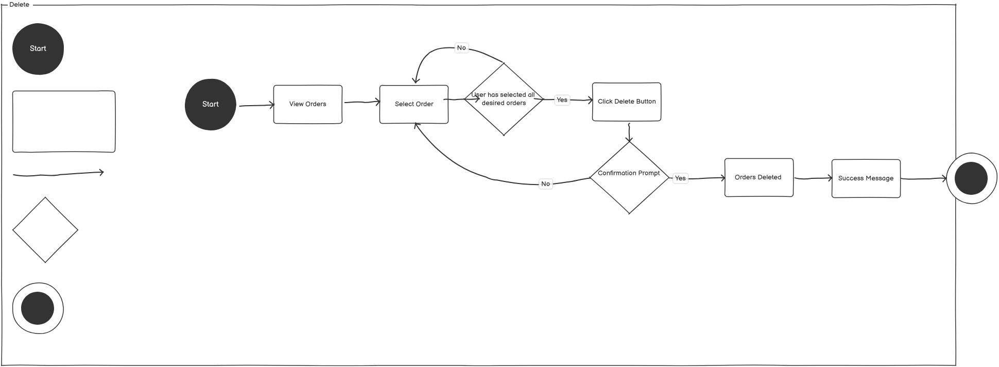
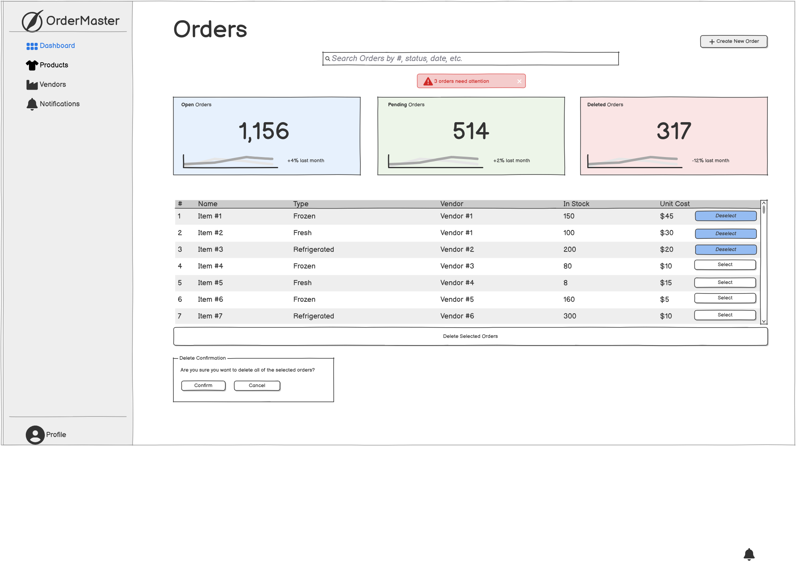

# UI / UX - Group Project Additions

## Landing / main application page

The program will open to a graphical user interface with a screen meant to resemble a restaurant floor. There will be circular icons which represent tables and orders and some action buttons along the bottom to go into different menus. There is also an option to place boxes to represent other areas of the building; these are not functional and are only visuals that help to orient the table graphics to match the layout. There are 3 buttons along the bottom: View Orders, Create Order, and Edit Layout. View Orders will load a secondary page that displays orders in a list and allows some modifications. "Create Order" will bring the user to the View Orders page and automatically direct them to the "Add Order" page; this just acts as a quick shortcut. "Edit Layout" will provide a very basic editor for the graphical layout that allows the user to create, delete, or move tables or the "generic area" boxes.

## Search
* 
* 
* user flow description of behavior
* wireframe that reflects understanding of Jakob's Ten Usability Heuristics and Gestalt Principles

1. **Start**

    The user begins at the home page, where they see a simple layout of the restaurant.

2. **Select Create New Order**

    The user selects the 'Create' button on the sidebar.

3. **Select Table Number**

    The user is prompted to select the table number for the order.

4. **Select View Order**

    The user will be shown a list or current orders and there statuses 

---
## Create

**User Flow Description of Behavior**
The application behaves as follows:
* When a user clicks "Create" on the sidebar, it open the "Create" UI
* The user is prompted to select a table, the table selected must be available
* The user is directed to enter the information about the order
* The user is then asked to confirm they would like to save the order
---
1. **Start**

    The user begins at the home page, where they see a simple layout of the restaurant.

2. **Select Create**

    The user selects the 'Create' button on the sidebar.

3. **Select Table Number**

    The user is prompted to select the table number for the order.

4. **Enter Information**

    The user has a series of text boxes to fill out for the information in the order.

5. **Save Order**

    A modal dialog appears, asking, "Save Order?" The user has two options:
     * Confirm: Saves and Creates the order.
     * Cancel: Aborts the action and returns to the order list.

6. **Order Created**

    If confirmed, the system creates the Order and sends the user to the homepage.

## Update

User Flow Description of Behavior The application behavior is as follows:

- The user opens the application
- The user selects a table that has an order
- The user will then change the neccesary information
- When the user is satisfied with the changes they then will click save

## Delete (Optional)

**User Flow Description of Behavior**
The application behavior is as follows:
* When a user clicks "Select" next to an order, they are visually informed that the specific order is selected.
* Upon clicking "Delete," a confirmation modal ensures error prevention by asking for user verification.
* If confirmed, the order is removed from the list, with immediate feedback provided through a success message. This flow reduces user errors and enhances control.

1. **Start**
The user begins at the order management dashboard, where they see a list of current restaurant orders.
2. **View Orders**
The user reviews the list of orders displayed in rows, each with order details and actions.

3. **Select Order**
The user clicks the "Select" button next to the specific order they want to delete.

4. **Click Delete Button**
A "Delete" button appears below the list. The user clicks this button to initiate deletion.

5. **Confirmation Prompt**
A modal dialog appears, asking, "Are you sure you want to delete this order?" The user has two options:

   * Confirm: Deletes the order.
   * Cancel: Aborts the action and returns to the order list.

6. **Order Deleted**
If confirmed, the system deletes the selected order, which is removed from the list.

7. **Success Message**
A success message ("Order successfully deleted") appears, confirming the action.

## Batch (Honors)

The Batch process is quite similar to that of the Delete process, because they are both done from the same menu. When a user wants to batch-delete orders, they would most likely not expect to have to enter a separate, dedicated menu to do that. Putting the two processes together is more user-friendly and much neater.

1. The user is brought to the landing page when the program is initialized.

2. There will be a button called "View Orders" that allows the user to see all orders as a list. The user clicks on this button.

3. Each order has a "Select" button to the far-right. The user clicks this, and the button will become depressed and change its label to say "Deselect". Clicking it again will deselect that order.

4. From here, the user will select any number of orders using the Select buttons. If they are not done, they will continue to select orders; if they have selected the orders that they want, the next step will commence.

5. The user will click on the "Delete" button towards the bottom of the page, which will have different text to accomondate for more than one order.

6. A confirmation dialog will pop, again with different text, And the user is given a "yes" button and a "no" button. If the user selects "No", then the dialog will disappear. Notably, the orders will remain selected after "No" is chosen, as it would be annoying for the user to have to re-select every order if they selected the wrong option. If the user selects "Yes", however, the selected orders are removed from the database.

7. A confirmation dialog will pop, informing the user that the deletion was successful.

